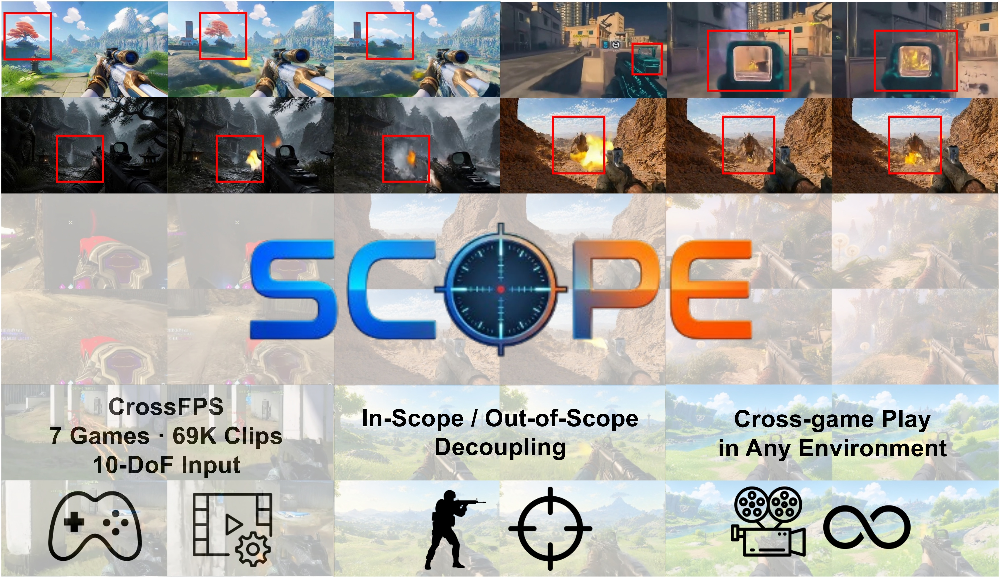
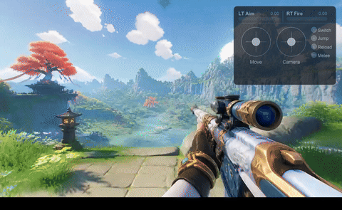
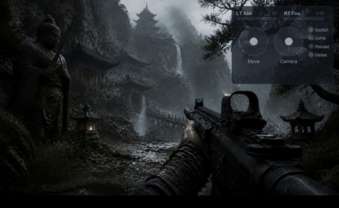

<div align="center">
  

# ${\color{#1E64C8}\textbf{S}}{\color{#3CA0DC}\textbf{C}}{\color{#3CA0DC}\textbf{O}}{\color{#D27828}\textbf{P}}{\color{#B4501E}\textbf{E}}$: ${\color{#1E64C8}\textbf{S}}$**imulating** ${\color{#3CA0DC}\textbf{C}}$**ross-game** ${\color{#3CA0DC}\textbf{O}}$**perations in** ${\color{#D27828}\textbf{P}}$**layable** ${\color{#B4501E}\textbf{E}}$**nvironments for FPS World Models**

${\color{#1E64C8}\textbf{S}}{\color{#3CA0DC}\textbf{C}}{\color{#3CA0DC}\textbf{O}}{\color{#D27828}\textbf{P}}{\color{#B4501E}\textbf{E}}$ is an interactive world model for FPS games with 10-DoF action control, trained on 69K clips across 7 games.

</div>


<div align="center">

[](https://github.com/z2tong/SCOPE)
[](https://arxiv.org/abs/XXXX.XXXXX)
[](https://huggingface.co/zizhaotong/SCOPE)
[](https://huggingface.co/collections/zizhaotong/crossfps)
[](LICENSE)


</div>

-----

We are excited to introduce ${\color{#1E64C8}\textbf{S}}{\color{#3CA0DC}\textbf{C}}{\color{#3CA0DC}\textbf{O}}{\color{#D27828}\textbf{P}}{\color{#B4501E}\textbf{E}}$, an open-source interactive world model for first-person shooter (FPS) games. Positioned as a top-tier action-conditioned world model, it offers the following features.
- **Hybrid Action Space**: Jointly processes continuous (4D dual-joystick) and discrete (6 binary buttons) control signals within a unified framework — the first FPS world model to do so.
- **Dense Per-Frame Conditioning**: Resolves overlapping actions at every single frame, enabling simultaneous multi-action composition (e.g., moving + aiming + firing) that reflects real gameplay complexity.
- **Cross-Game Generalization**: Trained on 7 diverse FPS titles, a single model generalizes zero-shot to entirely unseen game environments without fine-tuning.
- **In-Scope / Out-of-Scope Decoupling**: Spatially selective conditioning that separates localized in-scope effects (weapon recoil, HUD) from stable out-of-scope world generation — without any segmentation labels.

## 🎬 Demo Results

<div align="center">
  <table>
    <tr>
      <td align="center"><br><sub>It Takes Two</sub></td>
      <td align="center"><br><sub>Genshin Impact</sub></td>
      <td align="center"><br><sub>Black Myth: Wukong</sub></td>
    </tr>
  </table>
</div>

> Generated at 480×832 resolution, 81 frames @ 20 FPS (~4 seconds), conditioned on 10-DoF action inputs.

## 🔥 News
- May 2026: 🎉 We release the model weights, inference code, and CrossFPS dataset.

## ⚙️ Quick Start

This codebase is built upon [Wan2.2](https://github.com/Wan-Video/Wan2.2). Please refer to their documentation for environment setup.

### Installation

Clone the repo:
```bash
git clone https://github.com/z2tong/SCOPE.git
cd SCOPE
```

Install dependencies (we recommend [uv](https://github.com/astral-sh/uv) for fast, reproducible environment setup):
```bash
# Using uv (recommended)
uv venv --python 3.10
source .venv/bin/activate
uv pip install -r requirements.txt
uv pip install -e .

# Or using conda + pip
conda create -n scope python=3.10 && conda activate scope
pip install -r requirements.txt
pip install -e .
```

Install [`flash_attn`](https://github.com/Dao-AILab/flash-attention) (recommended for faster inference):
```bash
pip install ninja
pip install flash-attn --no-build-isolation
```

### Model Download

All required weights (DiT + Text Encoder + VAE + Tokenizer) are packaged in a single HuggingFace repo:

```bash
pip install "huggingface_hub[cli]"
huggingface-cli download zizhaotong/SCOPE --local-dir ./SCOPE
```

<details>
<summary><b>Directory layout after download</b></summary>

```
SCOPE/
├── model-00001-of-00003.safetensors       # DiT shard 1 (~5.0 GB)
├── model-00002-of-00003.safetensors       # DiT shard 2 (~5.0 GB)
├── model-00003-of-00003.safetensors       # DiT shard 3 (~4.6 GB)
├── model.safetensors.index.json           # Shard index
├── models_t5_umt5-xxl-enc-bf16.pth       # Text Encoder (UMT5-XXL, ~20 GB)
├── Wan2.2_VAE.pth                         # Video VAE (~700 MB)
├── google/umt5-xxl/                       # Tokenizer
│   ├── config.json
│   ├── spiece.model
│   └── tokenizer_config.json
└── config.json                            # Model config
```

</details>

### Inference

**Single image + action:**

```bash
python inference.py \
    --model_dir ./SCOPE \
    --input_image examples/example_0/image.png \
    --action_path examples/example_0/action.parquet \
    --prompt "In a whimsical, toy-inspired garden, the first-person view reveals a tactical weapon aimed forward along a sunlit path." \
    --output_dir ./outputs
```

**Batch processing (directory of images):**

```bash
python inference.py \
    --model_dir ./SCOPE \
    --input_image_dir ./my_images \
    --action_path examples/example_1/action.parquet \
    --prompt "A breathtaking view of a vibrant fantasy world, seen through an FPS perspective." \
    --output_dir ./outputs
```

### Examples

We provide 3 ready-to-run examples in `examples/`:

| Example | Scene | Command |
|---------|-------|---------|
| `example_0` | It Takes Two | `python inference.py --model_dir ./SCOPE --input_image examples/example_0/image.png --action_path examples/example_0/action.parquet --prompt "$(cat examples/example_0/prompt.txt)"` |
| `example_1` | Genshin Impact | `python inference.py --model_dir ./SCOPE --input_image examples/example_1/image.png --action_path examples/example_1/action.parquet --prompt "$(cat examples/example_1/prompt.txt)"` |
| `example_2` | Black Myth: Wukong | `python inference.py --model_dir ./SCOPE --input_image examples/example_2/image.png --action_path examples/example_2/action.parquet --prompt "$(cat examples/example_2/prompt.txt)"` |

**Tips**: If you have sufficient CUDA memory, you may increase the `--max_frames` parameter (e.g., to 161) to generate longer videos. The frame count must satisfy `n % 4 == 1`.

### Arguments

| Argument | Default | Description |
|----------|---------|-------------|
| `--model_dir` | *(required)* | Path to model directory containing all weights |
| `--input_image` | None | Single input image (first frame) |
| `--input_image_dir` | None | Directory of images for batch mode |
| `--action_path` | *(required)* | Action signal file (`.parquet`) |
| `--prompt` | `""` | Text prompt describing the scene |
| `--output_dir` | `./outputs` | Output directory |
| `--height` | 480 | Video height (pixels) |
| `--width` | 832 | Video width (pixels) |
| `--max_frames` | 81 | Max frames (must satisfy `n % 4 == 1`) |
| `--num_inference_steps` | 30 | Diffusion denoising steps |
| `--seed` | 0 | Random seed for reproducibility |

## 🎮 Action Signal Format

The `.parquet` file defines per-frame player inputs. Each row corresponds to one raw video frame (81 rows = 81 frames).

### Controller Buttons (6D binary: 0 or 1)

| Column | Game Action | Controller Button |
|--------|-------------|-------------------|
| `right_trigger` | Fire | RT |
| `left_trigger` | Aim Down Sights | LT |
| `south` | Jump | A |
| `right_thumb` | Melee | R3 |
| `west` | Reload | X |
| `north` | Weapon Switch | Y |

### Dual Joystick (4D continuous)

| Column | Axes | Function |
|--------|------|----------|
| `j_left` | `[x, y]` | Character movement (left stick) |
| `j_right` | `[x, y]` | Camera/aim rotation (right stick) |

> **Note**: The model handles 4× temporal compression internally via the VAE. Action sequences should have one entry per raw frame (not per latent frame).

## 🏗️ Model Architecture

Built on [Wan2.2-TI2V-5B](https://huggingface.co/Wan-AI/Wan2.2-TI2V-5B) (~5B parameters, BFloat16), the model inserts an `ActionModule` into each of the 30 DiT transformer blocks, enabling per-pixel action-conditioned video generation at 480×832 resolution, 81 frames @ 20 FPS (~4 seconds).

Each `ActionModule` contains two conditioning paths:
- **Mouse/Joystick Path**: Sliding-window temporal features → MLP fusion → pixel-wise temporal self-attention with RoPE
- **Keyboard/Button Path**: Button embedding → temporal windowing → cross-attention (video queries, keyboard keys/values)

Both output projections are zero-initialized for stable residual training on top of frozen pretrained weights. For detailed architecture specifications, see the [model card on HuggingFace](https://huggingface.co/zizhaotong/SCOPE).

## 📁 Project Structure

```
SCOPE/
├── inference.py                  # Inference entry point
├── pyproject.toml                # Package configuration
├── README.md
├── assets/                       # Documentation assets
├── examples/                     # Ready-to-run inference examples
│   ├── example_0/               # It Takes Two
│   ├── example_1/               # Genshin Impact
│   └── example_2/               # Black Myth: Wukong
└── diffsynth/                    # Core inference library
    ├── models/
    │   └── scope_dit.py          # DiT with ActionModule
    ├── pipelines/
    │   └── scope_pipeline.py     # Video generation pipeline
    ├── diffusion/                # Flow-matching scheduler
    ├── core/                     # Model loading & VRAM management
    └── utils/                    # Video I/O utilities
```

## 💻 Hardware Requirements

| Resource | Minimum | Recommended |
|----------|---------|-------------|
| GPU VRAM | 24 GB (with CPU offload) | 80 GB (A100/H200) |
| System RAM | 32 GB | 64 GB |
| Disk Space | ~45 GB | — |

## 📊 CrossFPS Dataset

The model is trained on [**CrossFPS**](https://huggingface.co/collections/zizhaotong/crossfps), the first multi-game FPS dataset with frame-aligned action telemetry:

| Property | Value |
|----------|-------|
| Games | 7 diverse FPS titles |
| Total Clips | 69,000+ |
| Action Dimensions | 10-DoF (6 buttons + 4D joystick) |
| Annotation | Frame-aligned action telemetry |
| Curation | Gameplay-bias removal for general visual-to-action mapping |

## 📜 License

This project is licensed under the [Apache License 2.0](LICENSE).

## ✨ Acknowledgements

We would like to express our gratitude to the following open-source projects for their invaluable contributions:
- [DiffSynth-Studio](https://github.com/modelscope/DiffSynth-Studio) — Base diffusion framework
- [Wan2.2](https://huggingface.co/Wan-AI/Wan2.2-TI2V-5B) — Pretrained video generation model
- [UMT5-XXL](https://huggingface.co/google/umt5-xxl) — Multilingual text encoder

## 📖 Citation

If you find this work useful for your research, please cite our paper:

```bibtex
@article{scope2026,
  title={SCOPE: Simulating Cross-game Operations in Playable Environments for FPS World Models},
  author={Zizhao Tong and Hongfeng Lai and Zeqing Wang and Zhaohu Xing and Kexu Cheng and Haoran Xu and Zhao Pu and Shangwen Zhu and Ruili Feng and Jian Zhao and Yan Zhang and Hao Tang and Yeying Jin and Ling Shao},
  year={2026}
}
```
